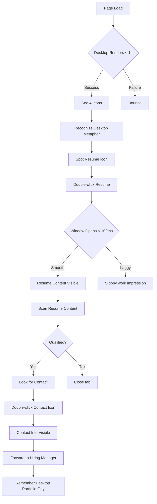
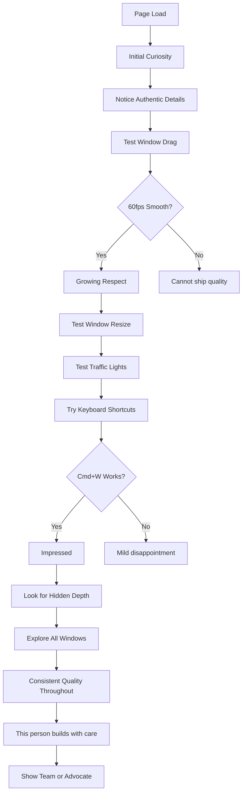

# UX Design Specification - nicksmith.software

**Author:** Nick
**Date:** 2026-01-07

---

## Executive Summary

### Project Vision

nicksmith.software is a portfolio website that recreates Mac OS X Tiger (10.4) for desktop and iOS 6 for mobile. The site demonstrates senior-level frontend engineering competence through its implementation - the portfolio IS the proof of skill.

**Core Insight:** The goal isn't Tiger archaeology - it's **creating the impression of craft through familiar visual language**. Tiger is the vehicle, not the destination.

### Target Users

**Primary: Rachel the Recruiter (30-Second Path)**
- Reviews 50-100 portfolios daily, spending 30-90 seconds each
- Needs instant recognition and obvious navigation
- Success: Finds Resume/Contact quickly, remembers "the Mac OS portfolio guy"
- UX Priority: Clarity, speed, screenshot-worthy visuals

**Primary: Marcus the Engineering Manager (10+ Minute Path)**
- Evaluates frontend candidates, values craft over buzzwords
- Tests every interaction: drag, resize, shortcuts, edge cases
- Success: Discovers progressive depth, thinks "this person builds with care"
- UX Priority: Polish, responsiveness, discoverable depth, zero broken states

**Secondary: Sarah the Fellow Engineer (Technical Validation)**
- Discovers via social media, opens DevTools immediately
- Inspects architecture, animation performance, state management
- Success: Tweets appreciation, expands professional network
- UX Priority: Clean code, 60fps performance, semantic markup

### Audience Priority

**MVP optimizes for Rachel's 30-second path.** Post-MVP features optimize for Marcus's depth exploration. When Rachel's clarity needs conflict with Marcus's authenticity expectations, **clarity wins for MVP**.

### Key Design Challenges

1. **Fidelity vs. Usability Balance**
   - Authentic Tiger recreation may conflict with modern web expectations
   - Reframed: Which authentic details create craft impression vs. which just add friction?

2. **Dual-Audience Optimization**
   - Same interface must serve 30-second scan AND 10-minute exploration
   - Rachel needs to *see* craft (visual); Marcus needs to *feel* craft (interaction)

3. **Performance as Core UX**
   - Any jank breaks the illusion AND the professional impression
   - Jank destroys craft impression more than missing features

4. **Boundary Behaviors**
   - Edge cases are where implementation time lives (80%)
   - Marcus tests every boundary - spec them explicitly

### Design Opportunities

1. **Universal Desktop Metaphor** - Icons, windows, double-click are universally understood
2. **Instant Differentiation** - Authentic cursor, wallpaper, chime create "wow" in first second
3. **Depth Rewards Exploration** - Terminal, Easter eggs reward curious engineers
4. **Implementation as Portfolio** - Every interaction is a skills demonstration

---

## Design Principles

### Principle 1: Craft Over Authenticity

**Statement:** When authentic Tiger behavior conflicts with the impression of quality, quality wins. We're demonstrating *our* craft, not Apple's archaeology.

**Example:** Tiger's zoom button does fit-to-content, not maximize. If this confuses users, we add a tooltip on hover - a modern addition that preserves visual authenticity while aiding usability.

**Counter-example:** We won't add a maximize button because "users expect it." That breaks visual authenticity without UX necessity.

### Principle 2: Memorability Requires Craft

**Statement:** Memorability without flawless execution is a liability. Every "wow" moment must be backed by polish. Partial polish is worse than no polish.

**Example:** If genie effect runs at 60fps, ship it. It's memorable AND demonstrates craft.

**Counter-example:** If genie effect stutters at 30fps, ship fade instead. A broken genie is worse than no genie.

### Principle 3: Quality Gate - 60fps or Don't Ship

**Statement:** No animation feature ships without 60fps validation on Chrome, Safari, and Firefox. Animation performance is the core value proposition, not a "nice to have."

**Enforcement:** Performance testing in CI. Regressions block deployment.

---

## Authenticity Hierarchy

Classification system for fidelity decisions:

| Level | Definition | Examples | Flexibility |
|-------|------------|----------|-------------|
| **Sacred** | Must match Tiger exactly | Traffic lights, Aqua gradients, window chrome, genie effect shape | Zero tolerance |
| **Adaptive** | Tiger-inspired but web-appropriate | Scroll behavior, touch targets, keyboard shortcuts | Adjust for usability |
| **Modern** | Things Tiger never had | Responsive breakpoints, accessibility features, reduced motion | Add as needed |

---

## Tiered Implementations

Visual specifications include fallback behaviors:

| Tier | When Used | Example: Minimize |
|------|-----------|-------------------|
| **Tier A** | Ideal (performance target met) | Genie effect animation |
| **Tier B** | Fallback (performance issues) | Scale + fade animation |
| **Tier C** | Reduced motion preference | Instant minimize |

The UX spec defines acceptable fallbacks, not just ideals.

---

## Boundary Behaviors Requirement

For every interactive element, the UX spec must define:

| Aspect | Must Specify |
|--------|--------------|
| Default state | Appearance at rest |
| Active/hover state | Visual feedback on interaction |
| Constraint behaviors | What happens at limits (min size, viewport edge) |
| Error/edge states | How failures appear (gracefully, with Tiger-authentic dialogs) |

**Rationale:** Micro-decisions at boundaries create or destroy the craft impression. Marcus tests every edge case.

---

## Core User Experience

### Defining Experience

The core experience of nicksmith.software centers on **window-based content discovery within an authentic Tiger desktop environment**. Two distinct user journeys share the same interface:

**Rachel's Experience (30 seconds):**
Icon recognition → Double-click → Window opens → Content visible → Decision made

**Marcus's Experience (10+ minutes):**
Initial curiosity → Interaction testing → Craft discovery → Depth exploration → Validation

**The critical interaction is window manipulation.** If windows feel laggy, unresponsive, or broken, both audiences fail simultaneously. The window system is the foundation upon which all other experiences depend.

### Platform Strategy

| Aspect | Specification |
|--------|---------------|
| **Application Type** | Single Page Application (SPA) |
| **Primary Input** | Mouse and keyboard |
| **Secondary Input** | Touch (iOS 6 Phase 3) |
| **Offline Support** | Not required |

**Responsive Breakpoints:**

| Breakpoint | Experience | Priority |
|------------|------------|----------|
| ≥1024px | Full Tiger desktop | MVP |
| 768-1023px | Scaled Tiger desktop | Post-MVP |
| <768px | iOS 6 mobile OR "best on desktop" message | Phase 3 / MVP fallback |

**Browser Support:**
- Chrome (latest 2 versions) - Full support
- Safari (latest 2 versions) - Full support
- Firefox (latest 2 versions) - Full support
- Edge (latest 2 versions) - Full support

### Effortless Interactions

**Zero-thought interactions (must feel automatic):**

| Interaction | Expected Behavior | Why Effortless |
|-------------|-------------------|----------------|
| Icon recognition | Resume, Projects, About, Contact self-explanatory | Universal metaphor |
| Double-click icon | Window opens with content | Desktop convention since 1984 |
| Window drag | Click title bar, move anywhere | Universal window behavior |
| Window close | Red traffic light closes window | Visual affordance |
| Window focus | Click window, comes to front | Expected z-index behavior |
| Keyboard shortcuts | ⌘W closes, ⌘M minimizes | Mac user muscle memory |

**Automatic behaviors (no user action required):**

| Trigger | Automatic Response |
|---------|-------------------|
| Page load complete | Startup chime plays (after first interaction) |
| Window clicked | Window receives focus, z-index updated |
| Window focused | Menu bar updates to show window's app |
| prefers-reduced-motion | Animations disabled or simplified |

### Critical Success Moments

| Moment | Timing | Success Criteria | Failure State |
|--------|--------|------------------|---------------|
| **First Impression** | 0-1s | Desktop renders, custom cursor visible, wallpaper loads | Blank screen, loading spinner, broken layout |
| **Recognition** | 1-5s | User identifies desktop metaphor, sees labeled icons | Confusion about what this is or how to navigate |
| **Content Access** | 5-15s | Window opens smoothly, content immediately readable | Lag, broken animation, content not visible |
| **Decision Point** | 15-30s | Rachel has enough info to forward to HM | Can't find Resume/Contact, gives up |
| **Craft Signal** | 2-5min | Window drag is 60fps, no jank on resize | Stuttery animations signal "sloppy work" |
| **Depth Discovery** | 5-10min | Marcus finds shortcuts, Terminal, Easter eggs | Nothing to discover, shallow experience |
| **Technical Validation** | 10+min | Clean DevTools, 60fps flame chart, semantic markup | Sarah sees performance issues, doesn't share |

**Make-or-break user flow:**
```
Icon visible → Double-click → Window animates open → Content renders → Window responds to drag/resize
```
Every step in this flow must succeed. Failure at any point breaks the experience for all audiences.

### Experience Principles

Building on the Design Principles (Craft Over Authenticity, Memorability Requires Craft, 60fps Quality Gate):

**Principle 4: Zero Learning Curve**

The desktop metaphor is universal. Any user who has used any computer understands: icons open things, windows contain content, the red button closes. No onboarding, no tutorial, no instructions required.

*Application:* Never add UI elements that require explanation. If it needs a tooltip to be understood, reconsider whether it belongs.

**Principle 5: Instant Feedback**

Every user action receives immediate visual feedback. The gap between action and response must be imperceptible (<16ms for animations, <100ms for state changes).

| Action | Feedback | Timing |
|--------|----------|--------|
| Mouse hover on icon | Subtle highlight | Immediate |
| Click on icon | Selection state | <16ms |
| Double-click icon | Window animation begins | <100ms |
| Drag window | Window follows cursor | <16ms per frame |
| Click traffic light | Button press state | Immediate |

*Application:* If an action takes time (rare), show progress. Never leave the user wondering "did that work?"

**Principle 6: Progressive Disclosure by Design**

Two navigation depths coexist without interference:

| Layer | Audience | Access Method | Content |
|-------|----------|---------------|---------|
| **Surface** | Rachel | Desktop icons | Resume, Projects, About, Contact |
| **Depth** | Marcus | Menus, shortcuts, exploration | Terminal, System Prefs, Easter eggs |

*Application:* Surface layer must be immediately obvious. Depth layer must be discoverable but never intrusive. A user who ignores menus entirely should still have a complete experience.

---

## Desired Emotional Response

### Primary Emotional Goals

| Audience | Initial Reaction | During Use | After Leaving |
|----------|-----------------|------------|---------------|
| **Rachel** | "Wow, this is different" | "I can navigate this easily" | "I remember that desktop guy" |
| **Marcus** | "This is interesting, let me explore" | "This person sweats the details" | "I want to work with this engineer" |
| **Sarah** | "How did they build this?" | "The implementation is clean" | "I should share this" |

### Emotional Journey Mapping

**Rachel's Emotional Journey:**

| Stage | Emotion | Trigger | Design Implication |
|-------|---------|---------|-------------------|
| Arrival (0-1s) | Surprise/Curiosity | Unexpected desktop interface | First impression must be visually striking |
| Recognition (1-5s) | Familiarity/Comfort | Desktop metaphor clicks | Universal icons, clear labels |
| Navigation (5-15s) | Confidence | Icons work as expected | Zero friction to content |
| Content Access (15-30s) | Satisfaction | Resume/Projects visible | Content readable immediately |
| Decision (30s+) | Positive Memory | "This was easy AND memorable" | Clean exit, shareable screenshot |

**Marcus's Emotional Journey:**

| Stage | Emotion | Trigger | Design Implication |
|-------|---------|---------|-------------------|
| Arrival (0-1s) | Curiosity | Unusual portfolio approach | Immediate craft signals |
| Testing (1-2min) | Skepticism→Respect | Interactions work smoothly | 60fps on every interaction |
| Exploration (2-5min) | Growing Appreciation | Details hold up to scrutiny | No broken states anywhere |
| Discovery (5-10min) | Delight | Easter eggs, Terminal, shortcuts | Reward depth exploration |
| Validation (10min+) | Professional Respect | "This person builds with care" | Consistent quality throughout |

**Sarah's Emotional Journey:**

| Stage | Emotion | Trigger | Design Implication |
|-------|---------|---------|-------------------|
| Arrival | Technical Curiosity | Opens DevTools immediately | Clean, semantic markup |
| Inspection | Evaluation | Examines animation performance | 60fps flame charts |
| Assessment | Professional Respect | State management, architecture | Well-structured code |
| Validation | Enthusiasm | "This is worth sharing" | Tweet-worthy details |

### Micro-Emotions to Cultivate

| Moment | Desired Micro-Emotion | How to Achieve |
|--------|----------------------|----------------|
| First cursor movement | "Ooh, attention to detail" | Custom Tiger cursor |
| First window open | "This is smooth" | 60fps animation |
| Window drag | "Responsive!" | Zero-lag tracking |
| Icon hover | "Polished" | Subtle highlight feedback |
| Keyboard shortcut works | "They thought of that!" | Expected shortcuts work |
| Easter egg discovery | "Ha! That's clever" | Rewarding surprises |

### Micro-Emotions to Prevent

| Moment | Emotion to Prevent | How to Prevent |
|--------|-------------------|----------------|
| Any animation | Frustration (jank) | 60fps quality gate |
| Window resize | Annoyance (lag) | Debounced, performant resize |
| Double-click miss | Confusion | Generous click timing |
| Edge of screen | Uncertainty | Clear constraint behavior |
| Content loading | Impatience | Instant content, no spinners |
| Mobile visit | Disappointment | Clear "best on desktop" message OR iOS 6 experience |

### Design Implications

| Emotion Goal | Design Requirement |
|-------------|-------------------|
| Immediate wow | Custom cursor, wallpaper, chime in first second |
| Effortless navigation | Desktop icons front and center, clear labels |
| Trust through polish | Zero jank, consistent interaction quality |
| Delight through discovery | Hidden depth for explorers (Terminal, shortcuts) |
| Professional respect | Clean code, semantic markup, 60fps performance |
| Memorable departure | Screenshot-worthy visuals, "the Mac OS guy" recall |

### Emotional Design Principles

**Principle 7: First Second Counts Most**

The emotional impression is set before conscious evaluation begins. Custom cursor, authentic wallpaper, and startup chime must appear within the first second. These "micro-wow" moments establish the quality baseline for everything that follows.

*Application:* Prioritize above-the-fold rendering. Cursor and wallpaper are critical path. Defer non-visible assets.

**Principle 8: Consistency is Trust**

Every interaction that works as expected deposits into a "trust account." Every broken interaction depletes it. Marcus tests dozens of interactions - a single failure undermines all successes.

*Application:* Better to have fewer features that all work perfectly than many features with inconsistent quality.

**Principle 9: Delight in Discovery**

The deepest satisfaction comes from finding something unexpected. Easter eggs, Terminal commands, keyboard shortcuts - these discoveries create the "I want to share this" moment that drives word-of-mouth.

*Application:* Hidden features should reward exploration without being necessary for basic use. Surface layer is complete; depth layer is bonus.

---

## UX Pattern Analysis & Inspiration

### Inspiring Products Analysis

**1. Mac OS X Tiger (10.4) - The Source Material**

| Aspect | Analysis |
|--------|----------|
| Core Problem Solved | Made computers approachable through intuitive spatial metaphors |
| Onboarding | Zero - desktop metaphor is self-explanatory |
| Navigation | Spatial (icons on desktop), hierarchical (folders), direct (double-click) |
| Delightful Interactions | Genie minimize, Exposé, smooth window dragging |
| Visual Design | Aqua's glossy buttons, pinstripes, drop shadows create tangible feel |
| Edge Cases | Graceful - windows constrain to screen, clear error dialogs |

**Why Users Loved It:** It felt *real* - buttons looked pressable, windows felt like physical objects you could manipulate.

**2. poolside.fm - Retro Web Recreation**

| Aspect | Analysis |
|--------|----------|
| Core Problem Solved | Nostalgic experience for engagement and brand differentiation |
| What They Did Well | Full commitment to aesthetic (no modern compromises), performance despite complexity |
| Delightful Interactions | Multiple "apps" to discover, cohesive retro audio experience |
| Key Insight | Full commitment creates stronger impression than half-measures |

**Transferable Lesson:** Authenticity requires commitment. Mixing "retro" with modern UI patterns reads as unfinished, not balanced.

**3. Stripe.com - Developer-Facing Portfolio of Craft**

| Aspect | Analysis |
|--------|----------|
| Core Problem Solved | Demonstrate technical competence through the website itself |
| What They Did Well | Micro-interactions signal engineering excellence at every turn |
| Performance | 60fps animations as baseline expectation, not stretch goal |
| Progressive Disclosure | Surface for decision-makers, depth for engineers who inspect |

**Transferable Lesson:** The website IS the portfolio. Every interaction is a skills demonstration, not just the content.

### Transferable UX Patterns

**Navigation Patterns:**

| Pattern | Source | Application to nicksmith.software |
|---------|--------|----------------------------------|
| Spatial memory | Tiger Desktop | Icons stay where placed, users remember locations |
| Click-to-focus | All desktop OSes | Window comes forward on click, universal expectation |
| Keyboard shortcuts | macOS tradition | ⌘W, ⌘M, ⌘Q for power users (Marcus's path) |
| Menu bar context | Tiger | Menu bar reflects focused application |

**Interaction Patterns:**

| Pattern | Source | Application to nicksmith.software |
|---------|--------|----------------------------------|
| Direct manipulation | Tiger/iOS | Drag windows, they follow cursor immediately |
| Visual affordance | Aqua UI | Buttons look clickable, traffic lights invite interaction |
| State feedback | All quality UIs | Hover, active, focus states on every interactive element |
| Constraint behavior | Desktop OSes | Windows can't leave viewport, minimum sizes enforced |

**Visual Patterns:**

| Pattern | Source | Application to nicksmith.software |
|---------|--------|----------------------------------|
| Glossy realism | Aqua | Traffic lights, window chrome must feel tangible |
| Pinstripes | Tiger | Subtle texture signals authenticity to nostalgic users |
| Drop shadows | Pre-flat design | Windows float above desktop, spatial hierarchy clear |
| Consistent chrome | Tiger | Every window uses identical title bar, resize handles |

### Anti-Patterns to Avoid

| Anti-Pattern | Why It Fails | How to Prevent |
|-------------|-------------|----------------|
| **Half-committed aesthetics** | "Retro but modern" reads as unfinished | Full Tiger commitment for Sacred items |
| **Broken interactions** | One jank destroys entire trust account | 60fps quality gate, no exceptions |
| **Clever over clear** | Obscure navigation frustrates Rachel | Surface layer uses universal icons |
| **Loading states visible** | Spinners break OS immersion | Instant content, preload critical assets |
| **Mobile as afterthought** | "Pinch to zoom" on desktop UI = failure | Clear "best on desktop" OR full iOS 6 |
| **Inaccessible nostalgia** | Screen reader users excluded | Semantic markup beneath visual layer |
| **Over-animation** | Too many effects feel gimmicky | Animate only meaningful state changes |
| **Inconsistent quality** | One polished feature, others rough | Even quality across all features |

### Design Inspiration Strategy

**What to Adopt Directly:**

| Element | Rationale |
|---------|-----------|
| Tiger's spatial metaphor | Icons, windows, desktop - universally understood |
| Aqua visual language | Sacred elements must match exactly |
| Click-to-focus window management | Universal OS convention |
| Keyboard shortcuts | Mac users expect ⌘W, ⌘M, ⌘Q |
| Traffic light buttons | Iconic, immediately recognizable |

**What to Adapt:**

| Element | Adaptation | Rationale |
|---------|------------|-----------|
| Zoom button behavior | Add tooltip on hover | Tiger's fit-to-content confuses modern users |
| Single-click selection | Forgiving double-click timing | Web users less precise than desktop |
| Menu bar | Show content-relevant menus | Tiger menus had OS functions; ours have portfolio functions |
| Scroll behavior | Smooth scrolling, not Tiger's | Modern expectation, doesn't break authenticity |

**What to Avoid:**

| Element | Rationale |
|---------|-----------|
| Skeuomorphism without purpose | Visual noise without functional benefit |
| "Retro" as performance excuse | Nostalgia doesn't forgive jank |
| Forcing navigation discovery | Rachel needs obvious paths |
| Abandoning mobile users | Clear message or iOS 6 experience required |
| Feature creep before polish | Better to ship fewer features at higher quality |

---

## Design System Foundation

### Design System Choice

**Approach: Hybrid Custom System**

A custom design system recreating Tiger's Aqua UI with headless accessibility primitives where beneficial. No existing design system (Material, Ant, Chakra) is appropriate because the visual language IS the product.

### Rationale for Selection

| Factor | Decision Driver |
|--------|----------------|
| Visual uniqueness required | No existing system resembles Aqua UI |
| Sacred elements need pixel precision | Custom components mandatory for authenticity |
| Accessibility is modern requirement | Headless primitives help compliance without visual compromise |
| Solo developer efficiency | Avoid reinventing focus management and keyboard navigation |
| Tiger-specific interactions | Genie effect, window behaviors need custom implementation |

### Implementation Approach

**Layer 1: Design Tokens**

| Token Category | Purpose | Examples |
|---------------|---------|----------|
| Colors | Aqua palette | Glossy blues, grays, traffic light colors |
| Typography | Tiger-era fonts | Lucida Grande equivalents, sizes, weights |
| Spacing | Consistent measurements | Window padding, icon grid spacing |
| Shadows | Depth hierarchy | Window shadows, menu shadows |
| Animation | Motion timing | Genie curve, window open/close timing |

**Layer 2: Atomic Components**

| Component | Classification | Notes |
|-----------|---------------|-------|
| AquaButton | Sacred | Glossy gradient, press states |
| TrafficLight | Sacred | Close/minimize/zoom trio |
| WindowChrome | Sacred | Title bar, resize handles |
| Icon | Sacred | Desktop icon with label |
| MenuBarItem | Sacred | Top menu bar items |
| Scrollbar | Adaptive | Aqua-styled but functional |

**Layer 3: Composite Components**

| Component | Composition | Notes |
|-----------|-------------|-------|
| Window | Chrome + ContentArea + ResizeHandles | Full window management |
| Application | Window + MenuIntegration | App-specific behavior |
| Desktop | Icons + Windows + MenuBar + Wallpaper | Full environment |
| Menu | MenuItems + Keyboard navigation | Dropdown menus |

**Layer 4: Accessibility Layer**

| Feature | Implementation | Notes |
|---------|---------------|-------|
| Focus management | Radix FocusScope or custom | Trap focus in modals |
| Keyboard navigation | Arrow keys in menus, ⌘ shortcuts | Mac-native patterns |
| Screen reader | ARIA labels, live regions | Announce window changes |
| Reduced motion | `prefers-reduced-motion` query | Instant transitions |

### Customization Strategy

**No External Theming Required**

The system IS the theme - Tiger Aqua is the only visual language. All "customization" is authenticity refinement, not user preference.

**Token-Driven Consistency**

| Principle | Application |
|-----------|-------------|
| Single source of truth | All Aqua values in one token file |
| Propagation | Token change updates all components |
| Reference validation | Compare implementation to Tiger screenshots |

**State Variations Only**

| State | Visual Change |
|-------|--------------|
| Default | Base Aqua appearance |
| Hover | Subtle highlight or glow |
| Active/Pressed | Depressed appearance, darker gradient |
| Disabled | Desaturated, reduced opacity |
| Focused | Focus ring (accessibility, not Tiger-authentic) |

---

## Defining Experience

### Core Interaction

**"Interact with a Tiger desktop that feels real"**

The window system is the foundation upon which all other experiences depend. Every feature - portfolio content, navigation, Easter eggs - is accessed through windows. If window manipulation feels responsive, authentic, and delightful, the portfolio succeeds. If windows feel laggy, broken, or fake, nothing else matters.

**What Users Will Say:**
*"It's a working Mac OS Tiger desktop - you can drag windows, click icons, everything works like a real computer."*

### User Mental Model

Users bring universal desktop experience accumulated over decades. The desktop metaphor requires zero explanation - icons open things, windows contain content, the red button closes. Our job is to meet those deeply ingrained expectations with Tiger-authentic execution and modern web performance.

**Expectation Mapping:**

| User Action | Expected Response | Failure State |
|-------------|------------------|---------------|
| Click window | Comes to front instantly | Delayed z-index change |
| Drag title bar | Window follows cursor exactly | Lag, jitter, or offset |
| Click traffic light | Immediate visual feedback | No press state |
| Double-click icon | Window opens with animation | Delay before animation starts |
| Resize corner | Smooth size change | Jumpy or laggy resize |
| ⌘W keyboard shortcut | Focused window closes | Nothing happens |

### Success Criteria

| Criterion | Measurement | Why It Matters |
|-----------|-------------|----------------|
| **Instant response** | <16ms from input to visual change | Slower feels broken to users |
| **60fps sustained** | No frame drops during drag/resize | Jank signals "this person can't code" |
| **Precise tracking** | Window position matches cursor offset exactly | Drift reveals amateur implementation |
| **Smooth animations** | Eased open/close, no pop-in or stutter | Abrupt transitions feel like cheap imitation |
| **Correct constraints** | Window stays within viewport bounds | Off-screen windows = broken experience |
| **Consistent quality** | Every window behaves identically | One broken window undermines all others |

**User Success Moments:**

| Moment | User Thought | What Triggered It |
|--------|-------------|-------------------|
| First drag | "This actually works" | Smooth, immediate response |
| Extended use | "It's so polished" | Consistent quality across interactions |
| Edge testing | "They thought of everything" | Boundaries handled gracefully |

### Pattern Analysis

**Pattern Type:** Established patterns with authenticity requirements

We're executing 40-year-old interaction patterns, not inventing new ones. Users already know how desktops work. Our differentiation is authenticity + performance, not novelty.

| Pattern | Status | Our Approach |
|---------|--------|--------------|
| Window drag | Established (1984) | Use proven libs (react-rnd), add Tiger chrome |
| Click-to-focus | Established | Standard z-index management |
| Traffic light buttons | Established (2001) | Visual authenticity is the differentiator |
| Icon double-click | Established | Generous timing for web context |
| Keyboard shortcuts | Established | Mac-native shortcuts (⌘W, ⌘M, ⌘Q) |
| Resize handles | Established | Corner and edge resize with correct cursors |

**No User Education Required:** The desktop metaphor is self-explanatory. If a user needs instructions, we've failed.

### Experience Mechanics

**Phase 1: Window Opening**

| Step | User Action | System Response | Timing |
|------|-------------|-----------------|--------|
| 1 | Sees desktop icon | Icon visible with clear label | On load |
| 2 | Single click | Icon shows selection state (highlight) | <16ms |
| 3 | Double click | Window open animation begins | <100ms |
| 4 | Animation plays | Smooth scale/fade or genie effect | 200-300ms |
| 5 | Animation completes | Window fully visible, content readable | Immediate |

**Phase 2: Window Manipulation**

| Action | Trigger | System Response | Feedback |
|--------|---------|-----------------|----------|
| **Drag** | Mousedown on title bar | Window follows cursor at 60fps | Cursor changes, window moves |
| **Focus** | Click anywhere on window | Window z-index increases, comes to front | Visual layer change |
| **Resize** | Drag corner or edge | Smooth size change, content reflows | Resize cursor, smooth animation |
| **Close** | Click red traffic light | Press state → close animation → window removed | Button depresses, window fades/shrinks |
| **Minimize** | Click yellow traffic light | Press state → genie/fade to dock position | Button depresses, window animates away |
| **Zoom** | Click green traffic light | Window resizes to fit content | Button depresses, smooth resize |

**Phase 3: Feedback System**

| Feedback Type | Trigger | Visual Response |
|--------------|---------|-----------------|
| Hover | Mouse over traffic light | Lights glow/brighten |
| Press | Mousedown on button | Button visually depresses |
| Drag active | During window drag | Window follows, subtle shadow change |
| Resize active | During resize | Resize cursor, smooth boundary change |
| Constraint hit | Window reaches viewport edge | Window stops, doesn't go off-screen |
| Focus change | Window clicked | Unfocused windows dim slightly |

**Phase 4: Task Completion**

| User Goal | Success State | Time to Success |
|-----------|--------------|-----------------|
| Find Resume | Resume window open, content visible and readable | <15 seconds |
| Explore Projects | Project windows accessible, can browse | <30 seconds |
| Find Contact | Contact information visible, actionable | <20 seconds |
| Overall Impression | "This person builds with craft" | <60 seconds |

---

## Visual Design Foundation

### Color System

The color system is prescribed by Mac OS X Tiger's Aqua UI. All Sacred colors must match reference screenshots exactly.

**Aqua Palette - Core Colors:**

| Color | Hex | Usage | Classification |
|-------|-----|-------|----------------|
| **Aqua Blue** | `#0066CC` / gradient | Window controls, buttons, highlights | Sacred |
| **Window Background** | `#E8E8E8` | Window content areas | Sacred |
| **Title Bar** | Linear gradient (`#D8D8D8` → `#B8B8B8`) | Window chrome | Sacred |
| **Traffic Light Red** | `#FF5F57` | Close button | Sacred |
| **Traffic Light Yellow** | `#FFBD2E` | Minimize button | Sacred |
| **Traffic Light Green** | `#28CA41` | Zoom button | Sacred |
| **Selection Blue** | `#3B99FC` | Selected items, focus | Sacred |
| **Text Primary** | `#000000` | Body text, labels | Sacred |
| **Text Secondary** | `#666666` | Secondary labels | Adaptive |
| **Desktop Background** | Tiger Aqua wallpaper | Desktop surface | Sacred |
| **Pinstripe** | `#F5F5F5` / `#E5E5E5` alternating | Window backgrounds | Sacred |

**Semantic Color Mapping:**

| Semantic Purpose | Tiger Equivalent | Notes |
|-----------------|------------------|-------|
| Primary Action | Aqua blue gradient button | Glossy, 3D appearance |
| Destructive Action | Red traffic light color | Close actions |
| Success State | Green traffic light color | Zoom/positive actions |
| Warning State | Yellow traffic light color | Minimize/caution |
| Focus Ring | Selection blue | Modern accessibility addition |
| Error State | Red with dialog | Tiger-style alert dialog |

### Typography System

**Tiger-Era Typography:**

| Element | Font | Size | Weight | Notes |
|---------|------|------|--------|-------|
| **Window Title** | Lucida Grande | 13px | Bold | Centered in title bar, shadowed |
| **Menu Bar** | Lucida Grande | 13px | Regular | Top menu items |
| **Menu Items** | Lucida Grande | 13px | Regular | Dropdown content |
| **Body Text** | Lucida Grande | 12px | Regular | Window content areas |
| **Icon Labels** | Lucida Grande | 12px | Regular | Below desktop icons, shadowed |
| **Button Text** | Lucida Grande | 13px | Regular | Aqua button labels |
| **Terminal** | Monaco | 12px | Regular | Terminal window content |

**Web Font Strategy:**

| Tiger Font | Web Equivalent | Fallback Stack |
|------------|---------------|----------------|
| Lucida Grande | System UI | `-apple-system, BlinkMacSystemFont, "Segoe UI", Roboto, sans-serif` |
| Monaco | SF Mono | `"SF Mono", Monaco, "Cascadia Code", "Courier New", monospace` |

**Type Scale (For Portfolio Content Windows):**

| Level | Size | Line Height | Usage |
|-------|------|-------------|-------|
| H1 | 24px | 1.3 | Page titles in content windows |
| H2 | 18px | 1.4 | Section headings |
| H3 | 14px | 1.4 | Subsection headings |
| Body | 13px | 1.5 | Primary content text |
| Small | 11px | 1.4 | Captions, timestamps, metadata |

### Spacing & Layout Foundation

**Tiger Spacing Tokens:**

| Token | Value | Usage |
|-------|-------|-------|
| `--space-xs` | 4px | Tight spacing, traffic light padding |
| `--space-sm` | 8px | Component internal spacing, button padding |
| `--space-md` | 12px | Between related elements |
| `--space-lg` | 16px | Window content padding |
| `--space-xl` | 24px | Section spacing within windows |
| `--space-xxl` | 32px | Desktop icon grid cell spacing |

**Window Dimensions:**

| Dimension | Value | Notes |
|-----------|-------|-------|
| Title bar height | 22px | Tiger-accurate measurement |
| Traffic light diameter | 12px | Including 1px border |
| Traffic light spacing | 8px | Center-to-center distance |
| Traffic light left margin | 8px | From window edge |
| Window border radius | 5px | Top corners only, bottom square |
| Window shadow | `0 10px 30px rgba(0,0,0,0.3)` | Soft drop shadow |
| Minimum window width | 200px | Enforced constraint |
| Minimum window height | 100px | Enforced constraint |
| Resize handle size | 16px | Corner resize target |

**Desktop Grid:**

| Aspect | Value | Notes |
|--------|-------|-------|
| Icon size | 48×48px | Standard Tiger desktop icon |
| Icon label width | 72px max | Text truncates with ellipsis |
| Grid cell | 80×90px | Icon + label space |
| Grid padding | 20px | From screen edges |
| Grid flow | Top-right, column-first | Tiger-authentic arrangement |
| Icon selection | Blue rounded rect | Behind icon on select |

**Menu Bar:**

| Dimension | Value | Notes |
|-----------|-------|-------|
| Height | 22px | Tiger-accurate |
| Apple logo width | 20px | Left-aligned |
| Menu item padding | 12px horizontal | Between items |
| Dropdown shadow | `0 2px 10px rgba(0,0,0,0.2)` | Subtle elevation |

### Accessibility Considerations

**Modern Accessibility Layer (Tiger Didn't Have These):**

| Feature | Implementation | Classification |
|---------|---------------|----------------|
| **Focus indicators** | 2px solid `#3B99FC` ring, 2px offset | Modern |
| **Color contrast** | Minimum 4.5:1 for all text | Modern |
| **Reduced motion** | `prefers-reduced-motion` query support | Modern |
| **Screen reader** | ARIA labels on all interactive elements | Modern |
| **Keyboard nav** | Full keyboard accessibility, visible focus | Modern |
| **Skip links** | Hidden skip-to-content for screen readers | Modern |

**Contrast Validation:**

| Combination | Ratio | WCAG Status |
|-------------|-------|-------------|
| Black text on window background (#E8E8E8) | 12.6:1 | ✓ AAA |
| Window title on title bar gradient | 7.2:1 | ✓ AA |
| White icon labels on dark wallpaper | 8.1:1 | ✓ AAA |
| Menu text on menu bar | 10.4:1 | ✓ AAA |

**Icon Label Readability:**

| Challenge | Solution |
|-----------|----------|
| Labels on varied wallpaper | White text with 1px dark shadow |
| Long application names | Truncate with ellipsis at 72px |
| Selection state | Blue background ensures contrast |

---

## Design Direction Decision

### Design Directions Explored

Within the Tiger Aqua constraint, four layout approaches were evaluated:

| Direction | Description | Pros | Cons |
|-----------|-------------|------|------|
| **A: Minimalist** | 4 icons only (Resume, Projects, About, Contact) | Fastest Rachel path, clean first impression | Less for Marcus to discover |
| **B: Populated** | 6-8 icons (adds Terminal, Prefs, Trash) | More authentic, depth for Marcus | May overwhelm Rachel |
| **C: Single-Window** | One window open at startup | Controlled experience | Atypical Tiger behavior |
| **D: Multi-Window** | 2-3 windows visible initially | Shows capability | Visual clutter |

### Chosen Direction

**Direction A: Minimalist Desktop for MVP**

A clean Tiger desktop with exactly 4 essential portfolio icons, optimizing for Rachel's 30-second recruiter path while maintaining Tiger authenticity.

**MVP Desktop Icons:**

| Icon | Label | Window Content | Position |
|------|-------|---------------|----------|
| 📄 | Resume | PDF-style document viewer | Top-right, row 1 |
| 📁 | Projects | Grid of project cards | Top-right, row 2 |
| 👤 | About | Photo + bio content | Top-right, row 3 |
| ✉️ | Contact | Contact information/form | Top-right, row 4 |

### Design Rationale

| Factor | Decision Driver |
|--------|----------------|
| **Rachel optimization** | 4 clear icons = instant path to Resume/Contact |
| **First impression** | Wallpaper visible, professional appearance |
| **Zero learning curve** | Obvious what to click, no confusion |
| **Performance** | Fewer elements = faster initial render |
| **Authenticity** | Tiger desktops were typically clean and organized |
| **Progressive enhancement** | Post-MVP adds depth without breaking MVP |

### Desktop Layout Specification

**Visual Layout:**

```
┌─────────────────────────────────────────────────────┐
│ 🍎 Finder  File  Edit  View  Go  Window  Help  ⏰  │
├─────────────────────────────────────────────────────┤
│                                                     │
│                                          [Resume]   │
│                                                     │
│                                          [Projects] │
│                                                     │
│                                          [About]    │
│                                                     │
│                                          [Contact]  │
│                                                     │
│                                                     │
│              [Tiger Aqua Wallpaper]                 │
│                                                     │
│                                                     │
│                                                     │
└─────────────────────────────────────────────────────┘
```

**Grid Specifications:**

| Aspect | Value |
|--------|-------|
| Grid origin | 20px from right edge, 40px from top (below menu bar) |
| Grid flow | Column-first, top-to-bottom |
| Cell size | 80×90px |
| Icon size | 48×48px centered in cell |
| Label position | Below icon, centered |

### Window Content Layout

**Default Window Sizes:**

| Window | Width | Height | Content Style |
|--------|-------|--------|--------------|
| Resume | 600px | 500px | Scrollable document, Tiger TextEdit aesthetic |
| Projects | 700px | 500px | Grid of project cards, Finder-style |
| About | 500px | 400px | Photo + bio, simple centered layout |
| Contact | 400px | 300px | Contact info or form, minimal |

**Window Opening Behavior:**

| Behavior | Specification |
|----------|--------------|
| Initial position | Centered in viewport with ±30px random offset |
| Cascade rule | New window 20px down and 20px right of previous |
| Session persistence | Window positions remembered during session |
| Reopen behavior | Same position as when closed |
| Minimum distance from edge | 50px from any viewport edge |

### Implementation Approach

**Phase 1 (MVP):**
- Direction A: 4 icons, clean desktop
- Static Finder menu bar
- Windows open from icon double-click only
- No dock (deferred)
- Basic keyboard shortcuts (⌘W, ⌘M)

**Phase 2 (Post-MVP):**
- Add Terminal icon (hidden depth for Marcus)
- Add System Preferences icon
- Implement Dock with minimized windows
- Menu bar updates based on focused window
- Add ⌘Q, additional shortcuts

**Phase 3 (Future):**
- Full Direction B populated desktop
- Easter eggs and hidden features
- iOS 6 mobile alternative experience
- Trash icon with drag-to-delete

---

## User Journey Flows

### Rachel's Resume Path (30 seconds)

**Goal:** Find resume and contact info, remember "the desktop portfolio guy"

**Flow Diagram:**



**Flow Specifications:**

| Step | Max Time | Success Criteria | Failure State |
|------|----------|------------------|---------------|
| Page load → Desktop visible | 1s | Wallpaper + icons render | Blank screen, spinner |
| Icon recognition | 3s | "Resume" label obvious | Confusion about navigation |
| Double-click → Window animation | 100ms | Animation starts immediately | Perceived delay |
| Animation → Content visible | 300ms | Resume content readable | Content loading state |
| Find contact | 10s | Contact icon visible on desktop | Must search or guess |

**Critical Success Moments:**

| Moment | User Thought | What Must Happen |
|--------|-------------|------------------|
| First second | "This is different" | Desktop renders, cursor visible |
| Icon click | "I know how this works" | Selection state, familiar metaphor |
| Window open | "This is smooth" | 60fps animation, instant content |
| Decision point | "Worth forwarding" | Content accessible, professional |

---

### Marcus's Exploration Path (10+ minutes)

**Goal:** Validate engineering craft through interaction testing, discover depth

**Flow Diagram:**



**Interaction Testing Sequence:**

| Test | Expected Behavior | Craft Signal | Failure Impact |
|------|-------------------|--------------|----------------|
| Window drag | 60fps, cursor-locked | "Smooth!" | "Sloppy implementation" |
| Window resize | Responsive, content reflows | "Polished" | "Unfinished" |
| Traffic light hover | Lights glow/brighten | "Attention to detail" | "Missed opportunity" |
| Traffic light click | Press state visible | "Thoughtful" | "Amateur" |
| ⌘W shortcut | Closes focused window | "They thought of that" | "Incomplete" |
| ⌘M shortcut | Minimizes window | "Wow" moment | "MVP acceptable" |
| Edge drag | Window stops at viewport | "Thorough" | "Broken experience" |

**Depth Discovery (Post-MVP):**

| Discovery | Trigger | Reaction |
|-----------|---------|----------|
| Terminal icon | Visual scan of desktop | "What's this?" |
| Terminal commands | Type `help` or `ls` | "Easter eggs!" |
| Hidden games | Specific commands | "I need to share this" |
| System Preferences | Icon click | "How deep does this go?" |

---

### Window Interaction Flow (Core Mechanic)

**This is the foundation for all journeys - every content access depends on windows working perfectly.**

**Opening Flow:**

| Step | Trigger | Response | Timing |
|------|---------|----------|--------|
| 1 | Double-click icon | Icon shows selection state | <16ms |
| 2 | Selection registered | Window open animation begins | <100ms |
| 3 | Animation plays | Smooth scale/fade from icon | 200-300ms |
| 4 | Animation complete | Window fully visible, focused | Immediate |
| 5 | Focus established | Content readable, interactive | Immediate |

**Manipulation Flow:**

| Action | Trigger | Feedback | Duration |
|--------|---------|----------|----------|
| **Drag** | Mousedown on title bar | Cursor: move, window follows | Continuous 60fps |
| **Focus** | Click anywhere on window | Z-index increases, others dim | <16ms |
| **Resize** | Drag corner/edge | Cursor: resize, smooth boundary | Continuous 60fps |
| **Constraint** | Drag to viewport edge | Window stops, cannot exit | Immediate |

**Closing Flow:**

| Step | Trigger | Response | Timing |
|------|---------|----------|--------|
| 1 | Hover red traffic light | Light glows/brightens | Immediate |
| 2 | Click red traffic light | Button press state | <16ms |
| 3 | Click registered | Close animation begins | Immediate |
| 4 | Animation plays | Window fades/shrinks | 150-200ms |
| 5 | Animation complete | Window removed from DOM | Immediate |
| 6 | Cleanup | Focus moves to next window or desktop | <16ms |

**Minimize Flow (Tiered):**

| Tier | Condition | Animation | Duration |
|------|-----------|-----------|----------|
| **A** | Performance target met | Genie effect to dock position | 300-400ms |
| **B** | Performance concerns | Scale down + fade | 200-300ms |
| **C** | Reduced motion pref | Instant hide | 0ms |

---

### Journey Patterns

**Navigation Patterns:**

| Pattern | Implementation | Used In |
|---------|---------------|---------|
| Double-click to open | Icon → Window with animation | All content access |
| Click to focus | Any window area → Bring to front | Multi-window management |
| Keyboard close | ⌘W → Close focused window | Power user shortcuts |
| Keyboard minimize | ⌘M → Minimize focused window | Power user shortcuts |
| Menu access | Click menu bar item → Dropdown | Secondary navigation |

**Decision Patterns:**

| Pattern | Implementation | Audience |
|---------|---------------|----------|
| Obvious defaults | 4 clearly labeled icons | Rachel (primary) |
| Hidden depth | Terminal, shortcuts, Easter eggs | Marcus (secondary) |
| Progressive disclosure | Surface → Depth without interference | Both |
| Single path to content | Icon → Window (no alternatives in MVP) | All users |

**Feedback Patterns:**

| Pattern | Trigger | Visual Response | Timing |
|---------|---------|-----------------|--------|
| Hover preview | Mouse enter interactive element | Glow, highlight, cursor change | Immediate |
| Press confirmation | Mousedown on button | Visual depression, color shift | <16ms |
| Motion feedback | Drag, resize, animate | 60fps smooth movement | Continuous |
| State persistence | Window position change | Position remembered in session | On change |
| Focus indication | Window receives focus | Z-index change, others dim | <16ms |

---

### Flow Optimization Principles

| Principle | Application | Measurement |
|-----------|-------------|-------------|
| **Minimize steps to value** | Rachel: 2 clicks to Resume content | <15 seconds to content |
| **Reduce cognitive load** | 4 icons only, self-explanatory labels | Zero instructions needed |
| **Immediate feedback** | Every action receives visual response | <16ms for state changes |
| **Graceful degradation** | Tier A/B/C animation fallbacks | No broken animations |
| **Error prevention** | Windows constrained to viewport | Cannot create broken state |
| **Recovery paths** | Closed window reopens from same icon | State can be restored |
| **Consistent quality** | Every window behaves identically | No surprising variations |
| **Progressive complexity** | Surface simple, depth available | Both audiences satisfied |

---

## Component Strategy

### Design System Components

**Headless Primitives (Behavior Layer):**

| Primitive | Source | Usage |
|-----------|--------|-------|
| FocusScope | Radix/Custom | Focus trapping in windows |
| useClickOutside | Custom hook | Deselect icons, close menus |
| Portal | React Portal | Render windows above desktop |
| useDraggable | react-rnd | Window drag behavior |
| useResizable | react-rnd | Window resize behavior |

**Gap Analysis:**

| Category | Available | Must Build |
|----------|-----------|------------|
| Visual styling | 0% | 100% - All Aqua components |
| Window behavior | 80% (react-rnd) | 20% - Tiger-specific constraints |
| Focus management | 90% | 10% - Custom focus order |
| Accessibility | 70% | 30% - ARIA for OS metaphor |

### Custom Components

#### Desktop

| Aspect | Specification |
|--------|--------------|
| **Purpose** | Root container for Tiger environment |
| **Content** | Wallpaper background, IconGrid, Window[], MenuBar |
| **States** | Default (clean), Active (windows open) |
| **Props** | `wallpaper: string`, `icons: IconConfig[]`, `children: ReactNode` |
| **Events** | `onDesktopClick` (deselect all), `onIconOpen` |
| **Accessibility** | `role="application"`, `aria-label="Mac OS X Tiger Desktop"` |
| **Styling** | Full viewport, wallpaper as background-image |

#### MenuBar

| Aspect | Specification |
|--------|--------------|
| **Purpose** | Top navigation bar (Tiger-authentic) |
| **Anatomy** | AppleLogo + AppName + MenuItems + Clock |
| **States** | Default, MenuOpen, ItemHover |
| **Props** | `appName: string`, `menus: MenuConfig[]`, `clock: boolean` |
| **Events** | `onMenuOpen`, `onMenuClose`, `onItemSelect` |
| **Accessibility** | `role="menubar"`, arrow key navigation, Escape closes |
| **Dimensions** | Height: 22px, Position: fixed top |

#### Icon

| Aspect | Specification |
|--------|--------------|
| **Purpose** | Desktop shortcut to open content windows |
| **Anatomy** | Image (48×48) + Label (below, max 72px width) |
| **States** | Default, Hover (subtle), Selected (blue bg), Dragging |
| **Props** | `src: string`, `label: string`, `position: {x, y}` |
| **Events** | `onClick` (select), `onDoubleClick` (open), `onDrag` |
| **Accessibility** | `role="button"`, `aria-label` with full name |
| **Interaction** | Single click selects, double click opens window |

#### Window

| Aspect | Specification |
|--------|--------------|
| **Purpose** | Draggable, resizable content container |
| **Anatomy** | WindowChrome + ContentArea + ResizeHandles (8) |
| **States** | Closed, Opening, Open, Focused, Unfocused, Minimizing, Minimized |
| **Props** | `id`, `title`, `defaultSize`, `defaultPosition`, `minSize`, `children` |
| **Events** | `onFocus`, `onClose`, `onMinimize`, `onZoom`, `onMove`, `onResize` |
| **Constraints** | Min: 200×100px, Max: viewport - 50px margin, Cannot exit viewport |
| **Accessibility** | `role="dialog"`, `aria-labelledby` title, focus trap when modal |

**Window State Machine:**

```
Closed → Opening (animation) → Open
Open → Focused (click) ↔ Unfocused (blur)
Open → Minimizing (animation) → Minimized
Minimized → Opening (restore) → Open
Open → Closing (animation) → Closed
```

#### WindowChrome

| Aspect | Specification |
|--------|--------------|
| **Purpose** | Window title bar with controls |
| **Anatomy** | TrafficLights (left) + Title (center) |
| **States** | Focused (full color), Unfocused (grayed out) |
| **Props** | `title: string`, `focused: boolean` |
| **Events** | `onDragStart`, `onDragEnd` |
| **Dimensions** | Height: 22px, Border-radius: 5px 5px 0 0 |
| **Styling** | Gradient background, centered title with shadow |

#### TrafficLights

| Aspect | Specification |
|--------|--------------|
| **Purpose** | Window control buttons |
| **Anatomy** | Close (red) + Minimize (yellow) + Zoom (green) |
| **States** | Default, Hover (show symbols), Pressed, Unfocused (gray) |
| **Props** | `focused: boolean`, `onClose`, `onMinimize`, `onZoom` |
| **Dimensions** | 12px diameter each, 8px gap between |
| **Position** | 8px from left edge, vertically centered |
| **Accessibility** | Each button: `role="button"`, `aria-label` |

**Traffic Light Visual States:**

| State | Close | Minimize | Zoom |
|-------|-------|----------|------|
| Default | `#FF5F57` solid | `#FFBD2E` solid | `#28CA41` solid |
| Hover | Show × symbol | Show − symbol | Show + symbol |
| Pressed | 10% darker | 10% darker | 10% darker |
| Unfocused | `#808080` all | `#808080` all | `#808080` all |

#### ResizeHandle

| Aspect | Specification |
|--------|--------------|
| **Purpose** | Window resize interaction targets |
| **Positions** | n, ne, e, se, s, sw, w, nw (8 handles) |
| **States** | Default (invisible), Active (during resize) |
| **Props** | `position: HandlePosition`, `onResizeStart`, `onResize`, `onResizeEnd` |
| **Cursors** | `nwse-resize`, `nesw-resize`, `ns-resize`, `ew-resize` |
| **Dimensions** | Corners: 16×16px, Edges: 8px thick |

#### ContentWindow

| Aspect | Specification |
|--------|--------------|
| **Purpose** | Scrollable content area inside Window |
| **Content** | Portfolio content (Resume, Projects, About, Contact) |
| **States** | Default, Scrolling (show scrollbar), Overflowing |
| **Props** | `padding?: string`, `scrollable?: boolean`, `children` |
| **Styling** | Background: `#E8E8E8`, optional pinstripe texture |
| **Accessibility** | Proper heading hierarchy (h1, h2, etc.), `role="main"` |

### Component Implementation Strategy

**Build Order and Dependencies:**

```
Phase 1: Foundation
├── Design Tokens (colors, spacing, typography)
├── Desktop (container)
├── Icon (entry points)
└── MenuBar (authenticity)

Phase 2: Window System
├── TrafficLights (controls)
├── WindowChrome (header)
├── ResizeHandle (resize targets)
└── Window (combines all, uses react-rnd)

Phase 3: Content
├── ContentWindow (scrollable area)
├── ResumeContent (portfolio)
├── ProjectsContent (portfolio)
├── AboutContent (portfolio)
└── ContactContent (portfolio)

Phase 4: Polish (Post-MVP)
├── Dock (minimize target)
├── MenuDropdown (secondary nav)
└── Terminal (depth feature)
```

**Dependency Graph:**

| Component | Depends On |
|-----------|------------|
| Desktop | Tokens |
| MenuBar | Tokens |
| Icon | Tokens |
| TrafficLights | Tokens |
| WindowChrome | Tokens, TrafficLights |
| ResizeHandle | Tokens |
| Window | WindowChrome, ResizeHandle, react-rnd, Tokens |
| ContentWindow | Tokens |
| *Content | ContentWindow |

### Implementation Roadmap

**Phase 1 - MVP Core:**

| Component | Priority | User Journey Impact |
|-----------|----------|-------------------|
| Design Tokens | Critical | Foundation for all components |
| Desktop | Critical | Container - nothing works without it |
| Icon | Critical | Rachel's entry point to content |
| Window | Critical | Core defining experience |
| WindowChrome | Critical | Window identity and controls |
| TrafficLights | Critical | Close/minimize functionality |
| ContentWindow | Critical | Portfolio content display |
| MenuBar | High | Tiger authenticity signal |

**Phase 2 - Polish:**

| Component | Priority | User Journey Impact |
|-----------|----------|-------------------|
| ResizeHandle (all 8) | High | Marcus tests resize behavior |
| Window animations | High | Craft impression |
| Icon selection state | Medium | Visual feedback |
| Dock | Medium | Minimize animation target |

**Phase 3 - Depth:**

| Component | Priority | User Journey Impact |
|-----------|----------|-------------------|
| MenuDropdown | Medium | Secondary navigation |
| Terminal | Medium | Marcus's depth discovery |
| AlertDialog | Low | Tiger-authentic errors |
| SystemPreferences | Low | Additional exploration |

---

## UX Consistency Patterns

### Button Hierarchy

**Button Types:**

| Type | Visual | Usage | States |
|------|--------|-------|--------|
| **Aqua Primary** | Blue glossy gradient | Main actions (Submit, Save) | Default, Hover (glow), Pressed (inset), Disabled |
| **Aqua Secondary** | Gray glossy gradient | Alternative actions (Cancel) | Default, Hover, Pressed, Disabled |
| **Traffic Lights** | Red/Yellow/Green circles | Window controls only | Default, Hover (symbols), Pressed (darker), Unfocused (gray) |

**Aqua Button Specifications:**

| Property | Value |
|----------|-------|
| Height | 24px |
| Padding | 12px horizontal |
| Border radius | 4px |
| Font | Lucida Grande, 13px |
| Gradient | Top to bottom, lighter to darker |

**Traffic Light Specifications:**

| Property | Value |
|----------|-------|
| Diameter | 12px |
| Spacing | 8px between |
| Position | 8px from left edge, vertically centered in title bar |
| Colors | Close: `#FF5F57`, Minimize: `#FFBD2E`, Zoom: `#28CA41` |

### Feedback Patterns

**Hover States:**

| Element | Feedback | Timing | Notes |
|---------|----------|--------|-------|
| Desktop Icon | Subtle brightness increase (+5%) | Immediate | Avoid over-animation |
| Traffic Lights | Show ×/−/+ symbols | Immediate | Symbols centered in circles |
| Menu Bar Items | Light highlight background | Immediate | Tiger-authentic blue |
| Aqua Buttons | Outer glow effect | Immediate | Subtle, not distracting |
| Resize Handles | Cursor change only | Immediate | `nwse-resize`, etc. |

**Press/Active States:**

| Element | Feedback | Timing |
|---------|----------|--------|
| Desktop Icon | Blue rounded rect selection | <16ms |
| Traffic Lights | 10% darker fill | <16ms |
| Menu Bar Items | Inverted (blue bg, white text) | <16ms |
| Aqua Buttons | Inset shadow, darker gradient | <16ms |
| Window Title Bar | Drag cursor + window follows | Continuous |

**Focus States (Modern Accessibility Layer):**

| Element | Focus Indicator | Visibility |
|---------|----------------|------------|
| All interactive elements | 2px solid `#3B99FC`, 2px offset | Keyboard navigation only |
| Focused window | Full-color title bar, higher z-index | Always visible |
| Unfocused window | Grayed title bar, traffic lights gray | Always visible |

### Navigation Patterns

**Primary Navigation: Desktop Icons**

| Action | Behavior | Visual Feedback |
|--------|----------|-----------------|
| Single click | Select icon | Blue highlight background |
| Double click | Open window | Icon flash + window animation |
| Click desktop | Deselect all | Icons return to default |
| Drag icon | Move position | Ghost image follows cursor |

**Secondary Navigation: Menu Bar**

| Action | Behavior | Visual Feedback |
|--------|----------|-----------------|
| Click menu title | Open dropdown below | Title highlighted |
| Hover while open | Switch to hovered menu | Dropdown follows |
| Click menu item | Execute action, close menu | Item highlights on click |
| Click outside | Close all menus | Menus disappear |
| Escape key | Close menus | Same as click outside |
| Arrow keys | Navigate items | Highlight follows |

**Keyboard Shortcuts:**

| Shortcut | Action | Scope |
|----------|--------|-------|
| ⌘W | Close focused window | Window focused |
| ⌘M | Minimize focused window | Window focused |
| ⌘Q | Quit application (close all) | Global |
| Tab | Navigate within window content | Window focused |

### Window Management Patterns

**Z-Index Rules:**

| Event | Z-Index Change |
|-------|---------------|
| Window opened | Assigned highest z-index |
| Window clicked | Promoted to highest z-index |
| Window closed | Removed from z-index stack |
| Window minimized | Removed from stack (to dock) |
| Window restored | Promoted to highest z-index |

**Position Rules:**

| Scenario | Position Calculation |
|----------|---------------------|
| First window | Viewport center ± 30px random offset |
| Additional windows | Previous position + 20px down + 20px right |
| Reopened window | Restore last position from session |
| Dragged | Follow cursor with initial offset preserved |
| At edge | Stop at viewport boundary (50px minimum visible) |

**Size Rules:**

| Constraint | Value |
|------------|-------|
| Minimum width | 200px |
| Minimum height | 100px |
| Maximum width | Viewport width - 100px |
| Maximum height | Viewport height - 72px (menu bar + buffer) |

**Focus Rules:**

| Event | Focus Behavior |
|-------|---------------|
| Window opened | New window receives focus |
| Window clicked | Clicked window receives focus |
| Window closed | Next window in stack receives focus |
| All windows closed | Desktop receives focus |
| Click desktop | Windows lose focus (unfocused styling) |

### Empty and Loading States

**Empty State: No Windows Open**

| Aspect | Specification |
|--------|--------------|
| Visual | Clean desktop with icons, wallpaper visible |
| Message | None - icons are self-explanatory |
| User action | Double-click any icon |

**Loading State Strategy: Avoid**

| Principle | Implementation |
|-----------|---------------|
| Pre-load all content | Portfolio content bundled with initial load |
| No loading spinners | Breaks Tiger immersion |
| Instant window content | Content ready when animation completes |

**If Loading Required (Edge Case):**

| Aspect | Specification |
|--------|--------------|
| Visual | Tiger-era indeterminate progress bar |
| Location | Center of window content area |
| Message | "Loading..." (Lucida Grande, 12px) |
| Duration | Should not occur in normal operation |

### Error Handling Patterns

**Tiger-Style Alert Dialog:**

| Property | Specification |
|----------|--------------|
| Position | Centered in viewport |
| Size | 400px width, height auto |
| Icon | Left-aligned warning (⚠️) or error (🛑) icon |
| Title | Bold, 13px, describes error type |
| Message | Regular, 12px, explains issue |
| Buttons | Right-aligned Aqua button(s) |
| Focus | Trapped within dialog |
| Dismiss | "OK" button or Escape key |

**Error Response Matrix:**

| Error Type | Response | Recovery |
|------------|----------|----------|
| Content load failure | Alert dialog | "OK" to dismiss, can retry |
| Form validation | Inline red message below field | Fix input, resubmit |
| Window constraint violation | Prevent action silently | Window stops at boundary |
| Keyboard shortcut unavailable | No response | Normal - shortcut doesn't apply |
| General error | Alert dialog | "OK" to dismiss |

**Inline Validation Pattern:**

| State | Visual |
|-------|--------|
| Valid | Green checkmark (✓) right of field |
| Invalid | Red message below field |
| Required empty | Red border on field |
| Focused invalid | Red border + message visible |

---

## Responsive Design

### Breakpoint Strategy

| Breakpoint | Range | Experience |
|------------|-------|------------|
| **Desktop** | ≥1024px | Full Tiger experience |
| **Mobile/Tablet** | <1024px | "Best on Desktop" message |

No tablet-specific breakpoint. Mobile and tablet both receive the fallback message. Tiger is a desktop experience.

### Desktop Experience

Full Mac OS X Tiger recreation with all features:

| Feature | Status |
|---------|--------|
| Window management | Full (drag, resize, close, minimize) |
| Desktop icons | 4 portfolio icons with grid layout |
| Menu bar | Tiger-authentic with app menus |
| Keyboard shortcuts | ⌘W, ⌘M |
| All portfolio content | Resume, Projects, About, Contact |
| Animations | 60fps target, tiered fallbacks |

### Mobile Fallback

Simple, Tiger-styled message with essential actions:

```
┌────────────────────────────────────┐
│                                    │
│      🖥️ Mac OS X Tiger             │
│                                    │
│   This portfolio is best           │
│   experienced on desktop.          │
│                                    │
│   ┌─────────────────────────┐      │
│   │   View Anyway (limited) │      │
│   └─────────────────────────┘      │
│                                    │
│   Quick Links:                     │
│   📧 nick@example.com              │
│   🔗 LinkedIn Profile              │
│   📄 Download Resume (PDF)         │
│                                    │
└────────────────────────────────────┘
```

| Element | Purpose |
|---------|---------|
| Message | Honest explanation of desktop-first design |
| Email link | Direct contact without needing desktop |
| LinkedIn link | Professional profile access |
| Resume PDF | Downloadable resume for recruiters on-the-go |
| Visual style | Tiger dialog aesthetic for brand consistency |

### Keyboard Support

| Shortcut | Action | Scope |
|----------|--------|-------|
| ⌘W | Close focused window | Window focused |
| ⌘M | Minimize focused window | Window focused |
| Tab | Navigate within window content | Window focused |
| Escape | Close open menus | Menu open |

Standard browser keyboard defaults apply elsewhere. No custom keyboard navigation beyond Mac-native shortcuts.

### Reduced Motion Support

| User Preference | Animation Behavior |
|-----------------|-------------------|
| No preference | Full animations (Tier A or B) |
| `prefers-reduced-motion: reduce` | Instant transitions (Tier C) |

Implementation: Single CSS media query wrapping animation properties.

### Browser Support

| Browser | Versions | Support Level |
|---------|----------|--------------|
| Chrome | Latest 2 | Full |
| Safari | Latest 2 | Full |
| Firefox | Latest 2 | Full |
| Edge | Latest 2 | Full |

**Testing scope:** Desktop browsers only for MVP. Mobile experience is intentionally minimal and requires no complex testing.
